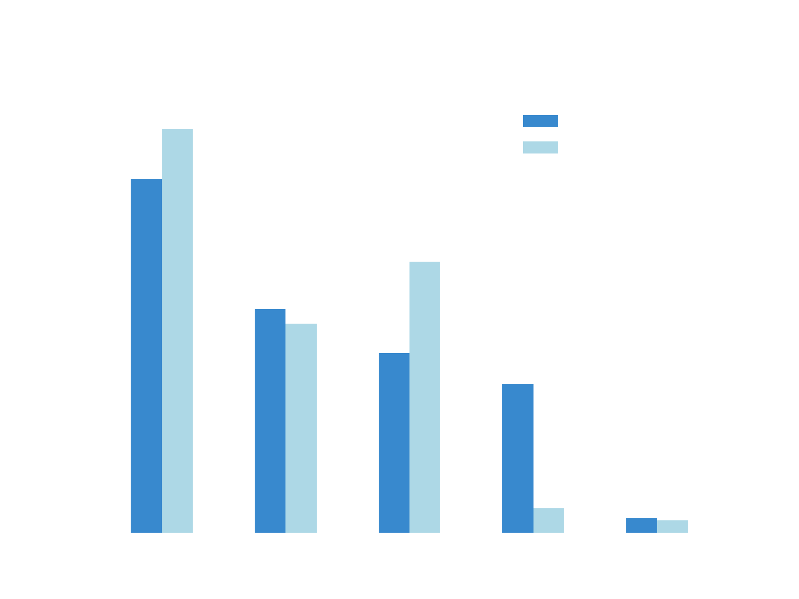
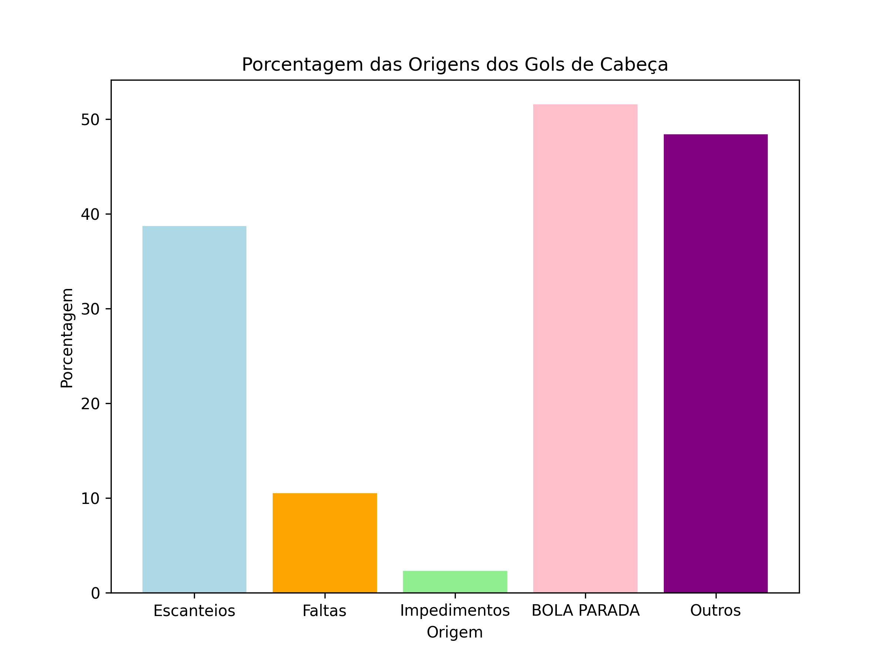

=====================================================
Relatório da Análise da Base de Dados Football Events
=====================================================

INTRODUÇÃO 
----------

O presente texto tem como objetivo discorrer sobre a análise de dados do dataset Football Events, que consiste em um conjunto de
eventos que ocorreram em 9.074 jogos de futebol em ligas europeias. Nessa base de dados, cada uma das mais de 900.000 linhas
representava um evento ocorrido. Sobre os dados coletados foram levantadas hipóteses e, utilizando Python e suas bibliotecas Pandas e
Matplotib, foi realizada uma análise com objetivo de confirmá-las ou negá-las.

HIPÓTESES PROPOSTAS
-------------------

As hipóteses a serem avaliadas pela análise realizada foram as seguintes:

1. **Chute de fora da área tem menor chance de conversão a gol.**
    Intuitivamente, espera-se que chutes de **Fora da Área** tenham menor chance de conversão a gol devido a vários fatores. Por
    exemplo, pelo chute vir de fora da área, o goleiro tem um maior tempo de reação para defender o chute. Além disso, há uma maior
    chance do chute ser bloqueado por um defensor, aumentando as dificuldades para marcar. Outros fatores incluem a menor precisão
    e força dos chutes provenientes de distâncias maiores.

2. **A maior parte dos gols de cabeça tem origem em lances de bola parada.**
    Devido à natureza mais organizada e previsível dos lances de **bola parada**, esses lances são comumente associados a gols de
    cabeça, em especial, os escanteios, que é tradicionalmente cobrado com bola levantada na área com intenção de um jogador bem
    posicionado conseguir cabecear. Assim, é natural esperar que parte considerável dos gols de cabeça tenham origem nesses lances.

3. **Times que jogam em casa tem maior taxa de vitórias**
    Alguma coisa bem massa. Alguma coisa bem massa. Alguma coisa bem massa. Alguma coisa bem massa. Alguma coisa bem massa.
    Alguma coisa bem massa. Alguma coisa bem massa. Alguma coisa bem massa. Alguma coisa bem massa. Alguma coisa bem massa.

PRÉ-PROCESSAMENTO DE DADOS
--------------------------

Inicialmente, a base de dados trabalhada continha 22 colunas, das quais apenas 8 seriam utilizadas para validação das hipóteses. Dessa
forma, um primeiro passo natural foi remover as colunas desnecessárias. Posteriormente, foram removidas as linhas que referiam-se a
comerciais, cartões amarelos, segundos cartões amarelos, cartões vermelhos, substituição, faltas sofridas (faltas sofridas vem aos
pares com faltas cometidas, para nossa análise bastava apenas um desses tipos de eventos), mão na bola e pênaltis cometidos.

RESULTADOS DA ANÁLISE
---------------------

1. **Chute de fora da área tem menor chance de conversão a gol.**

Estatísticas por Gol
^^^^^^^^^^^^^^^^^^^^

================  ============
Situação          Porcentagem 
================  ============
Dentro da área    88.26       
Fora da área      11.74       
================  ============

Estatísticas por Chute
^^^^^^^^^^^^^^^^^^^^^^

=========   ==============  ===============
Resultado   Porcentagem_in   Porcentagem_out
=========   ==============  ===============
Fora        38.34            43.80
Defendido   24.29            22.69
Bloqueado   19.51            29.45
Gol         16.19            2.67
Trave       1.67             1.38
=========   ==============  ===============

Gráfico
^^^^^^^

2. **A maior parte dos gols de cabeça tem origem em lances de bola parada.**

Estatísticas
^^^^^^^^^^^^

============  ===========
ORIGEM        Porcentagem 
============  ===========
Escanteios    38.74       
Faltas        10.53
impedimentos  2.30
BOLA PARADA   51.58
Outros        48.42      
============  ===========

Gráfico
^^^^^^^

3. **Times que jogam em casa tem maior taxa de vitórias**

Estatísticas
^^^^^^^^^^^^

==========  ===========
Resultado   Porcentagem
==========  ===========
Vitórias    50.13
Derrotas    30.84
Empates     19.03
==========  ===========

Gráfico
^^^^^^^

VALIDAÇÃO DAS HIPÓTESES
-----------------------

1. **Chute de fora da área tem menor chance de conversão a gol.**

Os resultados obtidos reforçam que chutes de Fora da Área têm uma chance menor de se transformar em gol. Nossa análise mostrou
que **88.26%** dos gols foram marcados **dentro da área**, enquanto só **11.74%** aconteceram **fora da área**. Isso mostra que
chutes de distâncias maiores enfrentam maiores dificuldades para resultar em gol.

2. **A maior parte dos gols de cabeça tem origem em lances de bola parada.**

A análise mostra que, nos dados analisados, 51.58% dos gols de cabeça tiveram origem em gols de cabeça. Esse resultado reforça em parte
a hipótese de que a maioria dos gols desse tipo surgem de escanteios, faltas e impedimentos. Todavia, a margem não é tão grande quanto
o esperado. Dessa forma, embora a hipótese seja confirmada, a análise revela que grande parte dos gols de cabeça têm origem em lances
bola parada. Além disso, como esperado, os gols com origem em escanteio representam parte substancial do total.

3. **Times que jogam em casa tem maior taxa de vitórias**

A análise dos dados confirma a hipótese de que times jogando em casa têm uma maior taxa de vitórias. 
Os resultados mostram que 50.13% dos jogos em casa resultam em vitórias para o time da casa, 
enquanto as derrotas representam 30.84% e os empates 19.03%. Essa diferença significativa reforça 
a vantagem de jogar em casa no futebol, que pode ser atribuída a fatores como familiaridade com o 
campo, apoio da torcida e ausência de desgaste com viagens.

DESAFIOS ENCONTRADOS
--------------------

- Interpretar o que é "fora da área" e "dentro da área", uma vez que as localizações na base de dados eram pouco mais abstratas como "ângulo difícil a direita", "ângulo difícil a esquerda" e "marca do pênalti".
- Diferenciar quando um evento tinha relação com o evento anterior ou não.
- Entender quando dois eventos diferentes ocorreram em uma mesma partida.

CONTRIBUIÇÃO DE CADA INTEGRANTE
-------------------------------

- Antonio Francisco Batista Filho: Responsável por validar a hipótese sobre a origem dos gols de cabeça. Colaborou com o pré-processamento dos dados e elaborou o relatório.

- Arthur Rabello Oliveira: Responsável por validar a hipótese sobre as vitórias do time da casa e elaboração do README.md.

- Rodrigo Severo Araújo: Responsável por validar a hipótese dos chutes de fora da área. Colaborou com o pré-processamento dos dados e elaborou o arquivo utils.py.